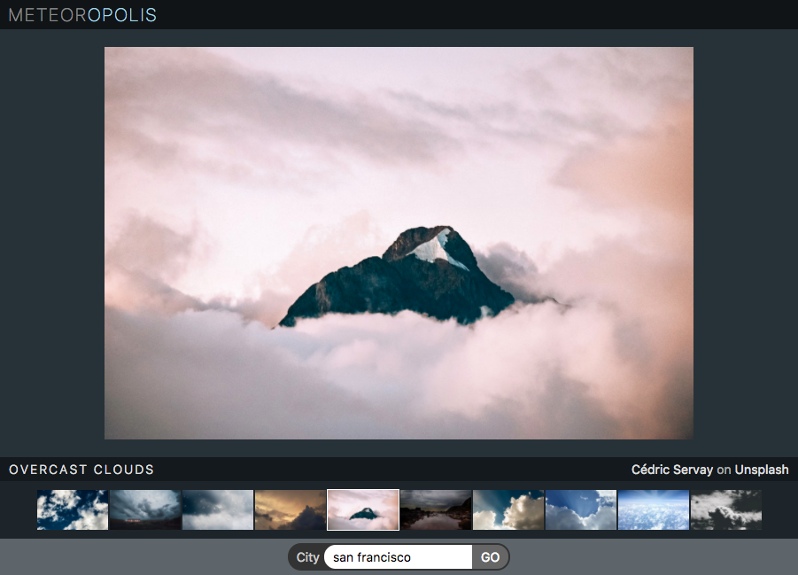

# Mini-weather... React edition

[Click here for live demo](https://mini-weatherapp.herokuapp.com/)

In this exercise we will revisit the [Mini Weather App](https://github.com/constructorlabs/mini-weatherapp) we produced last week and create a React version of it.

## Set-up

- Fork and clone the repo

- Run `npm install` to download dependencies

- To build project run `npm run dev` or `npm run dev -- --watch` to build continuously in the background.

- Use API keys generated for Mini Weather App to query OpenWeatherMap and Unsplash APIs.

- CSS and some placeholder React components have been supplied for you. You can insert the main photo into the element with the id `photos` and thumbnails into the element with id `thumbs`.

- Before starting to code, draw a layout diagram and a tree diagram of the components. Have a think about which component will have state and what they will store. Think about what data will need to be passed to other components as props.

## Objectives

- [ ] Use `fetch` to retrieve the weather for a single day. You can see the documentation at [https://openweathermap.org/current](https://openweathermap.org/current). For now, we'll set London or another location of your choice as the default. You can use the React lifecycle method `componentDidMount` to run the initial `fetch`.

- [ ] Once you've retrieved the weather data, use its `description` property to get matching images from Unsplash. You can see the documentation for image search at [https://unsplash.com/documentation#search-photos](https://unsplash.com/documentation#search-photos).

- [ ] Display the images as a gallery of clickable thumbnails. When a thumbnail is clicked we should display that image as the main image.

## Stretch goals

- [ ] Use the `Search` component to display what the weather is like in other cities

- [ ] Display photographer credits in `Info` component with link to their portfolio on Unsplash

- [ ] Display white border around thumbnail of image currently displayed as main image using `active` class

- [ ] Add a feature of your choice
